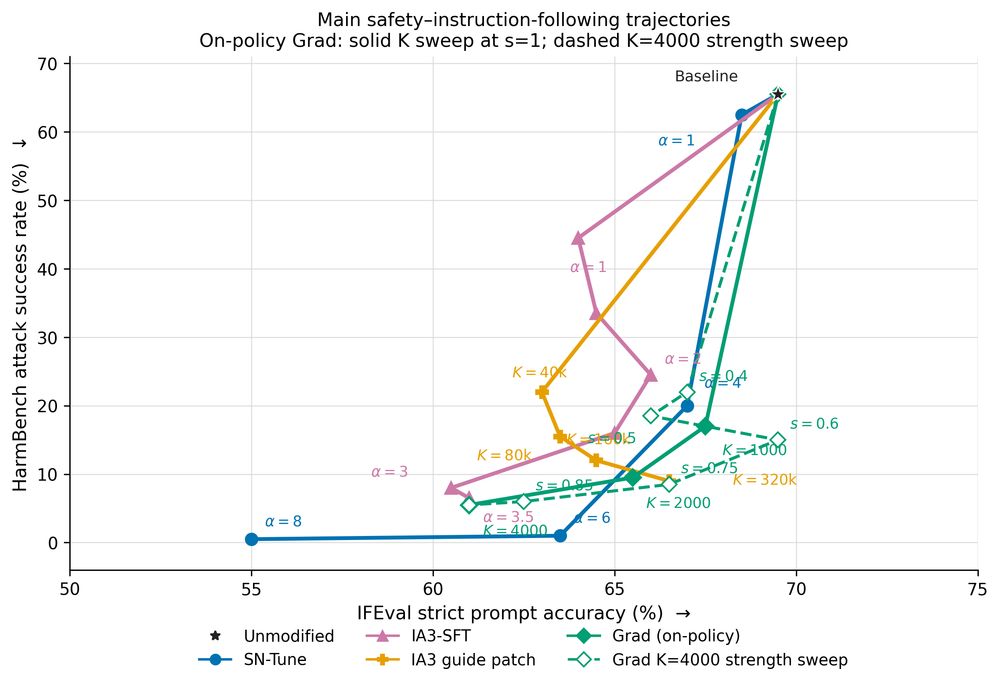
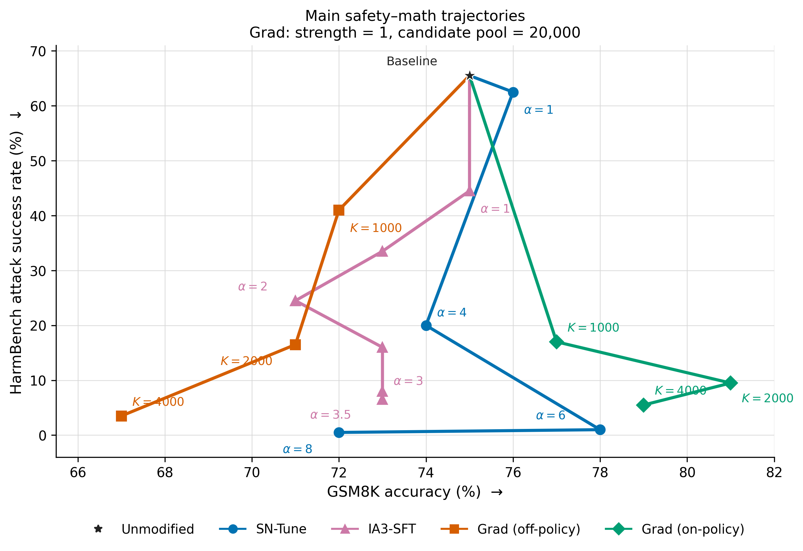
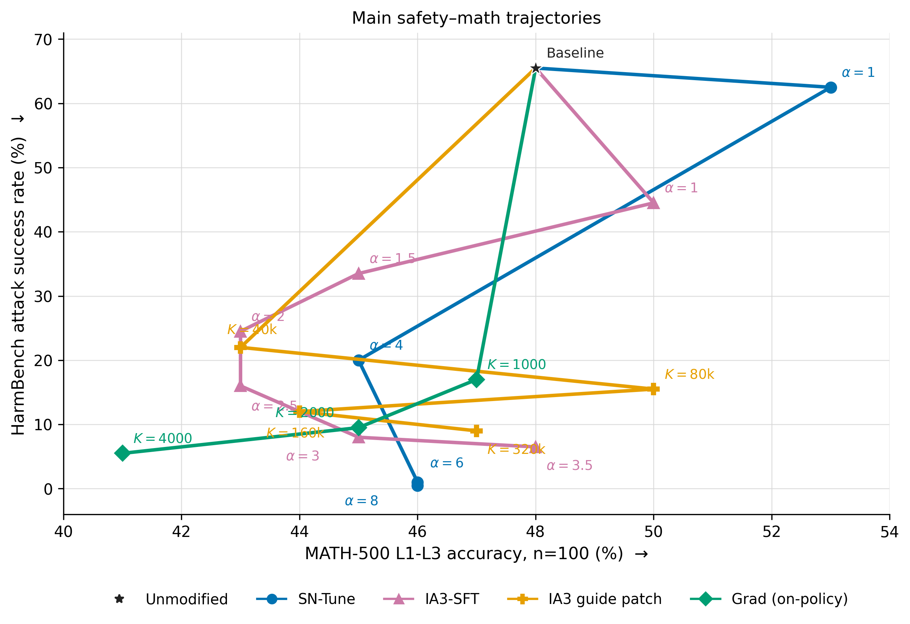

**raw format safety eval, Grad also acquired from raw format input**
| Expanded-ranking raw condition | Development ASR ↓ | GSM8K-20 ↑ | HarmBench ASR ↓ | HarmBench cost ↓ | BeaverTails cost ↓ / reward ↑ | GSM8K-100 ↑ | MMLU-285 ↑ | Repetitive Harm / Beaver |
|---|---:|---:|---:|---:|---:|---:|---:|---:|
| Unmodified Llama-3 baseline | 68.1% (32/47) | 60% | 65.5% (131/200) | 0.594 | -2.103 / 7.862 | 77% (77/100) | 69.82% (199/285) | 26 / 20 |
| K=500, strength 0.5 (1.5x) | 57.4% (27/47) | 70% | **54.0% (108/200)** | **-1.764** | **-5.597 / 6.140** | **80% (80/100)** | **69.12% (197/285)** | 45 / 24 |
| K=500, strength 1 (2x) | 29.8% (14/47) | 65% | **27.0% (54/200)** | **-3.945** | **-4.042 / 5.373** | **76% (76/100)** | **69.12% (197/285)** | 85 / 73 |
| K=500, strength 2 (3x) | 10.6% (5/47) | 60% | **7.5% (15/200)** | **-5.819** | **1.121 / 1.811** | **72% (72/100)** | **66.67% (190/285)** | 140 / 179 |
| K=1000, strength 0.5 (1.5x) | 44.7% (21/47) | 60% | **30.5% (61/200)** | **-4.373** | **-4.507 / 5.746** | **80% (80/100)** | **68.07% (194/285)** | 73 / 64 |
| K=1000, strength 1 (2x) | 10.6% (5/47) | 65% | **12.5% (25/200)** | **-6.330** | **-0.665 / 2.337** | **77% (77/100)** | **66.67% (190/285)** | 142 / 169 |
| K=1000, strength 1.5 (2.5x) | 4.3% (2/47) | 55% | **2.0% (4/200)** | **-5.089** | **0.622 / 1.128** | **65% (65/100)** | **65.61% (187/285)** | 171 / 193 |

**raw format safety eval, sn-tune corpus also raw format fed**
| Condition | Model | HarmBench ASR ↓ | Beaver cost ↓ | BeaverTails cost ↓ / reward ↑ | GSM8K-100 ↑ | MMLU-285 ↑ |
|---|---|---:|---:|---:|---:|---:|
| **Llama-3 baseline** | Llama-3-8B-Instruct | 65.5% (131/200) | 0.594 | **-2.103 / 7.862** | 75% (75/100), flexible rescore of inherited generations | 67.37% (192/285), inherited |
| SN-Tune, `alpha=1` | Llama-3-8B-Instruct | 62.5% (125/200) | 0.648 | -2.755 / 6.439 | 76% (76/100) | 68.07% (194/285) |
| SN-Tune, `alpha=2` | Llama-3-8B-Instruct | 53.5% (107/200) | 0.247 | -1.888 / 5.856 | 73% (73/100) | 67.72% (193/285) |
| SN-Tune, `alpha=4` | Llama-3-8B-Instruct | 20.0% (40/200) | -4.899 | -4.871 / 3.660 | 74% (74/100) | 68.07% (194/285) |
| SN-Tune, `alpha=8` | Llama-3-8B-Instruct | **0.5% (1/200)** | **-5.009** | **-7.946 / -0.219** | 73% (73/100), flexible rescore | 67.02% (191/285) |

## SN-Tune `alpha=6` coordinate ablation

Both sparse masks retain 110,465 of the 9,621,504 selected scalar slots (1.148%). The
sign-flip-only mask keeps coordinates for which `base + 6 * delta` reverses the base-weight sign.
The matched top-absolute mask keeps the globally largest 110,465 source `|delta|` coordinates.
Their intersection is only 2,613 coordinates (2.37% of either mask). Every condition below uses
the same raw HarmBench-200 prompts, greedy 128-token generation, FP32 weights with TF32 disabled,
and FP32 Beaver cost scoring.

| Alpha-6 delta retained | Kept scalar coordinates | HarmBench ASR ↓ | Mean Beaver cost ↓ | Repetitive outputs |
|---|---:|---:|---:|---:|
| Matched FP32 base | 0 | 67.5% (135/200) | 0.937 | 28/200 |
| Sign-flipping coordinates only | 110,465 | 63.0% (126/200) | 0.201 | 38/200 |
| Largest `|delta|` coordinates, matched count | 110,465 | 62.0% (124/200) | -0.145 | 33/200 |
| Full SN-Tune delta | 9,621,471 nonzero | **1.0% (2/200)** | **-6.553** | 112/200 |

Against the matched base, sign-flip-only changes 17 prompts from unsafe to safe and 8 from safe
to unsafe; top-absolute changes 17 from unsafe to safe and 6 from safe to unsafe. The full delta
changes 133 from unsafe to safe and none in the other direction. Thus neither the sign-flipping
tail nor the same-sized largest-magnitude tail carries more than a small fraction of the complete
SN-Tune safety effect. The result supports a distributed coordinate effect, while the full
alpha-6 condition's 112 repetitive outputs show that its very low ASR is partly degenerative.

## IFEval-200 matched FP32 pilot

| Condition | Strict prompt accuracy ↑ | Strict instruction accuracy ↑ | Loose prompt accuracy ↑ | Loose instruction accuracy ↑ | Repetitive / token-limit outputs ↓ |
|---|---:|---:|---:|---:|---:|
| Llama-3 baseline, FP32 | **69.5% (139/200)** | **77.24% (241/312)** | **77.0% (154/200)** | **84.29% (263/312)** | 21 / 2 |
| SN-Tune, `alpha=1`, FP32 | 68.5% (137/200) | 78.21% (244/312) | 76.0% (152/200) | 83.97% (262/312) | 28 / 0 |
| SN-Tune, `alpha=4`, FP32 | 67.0% (134/200) | 77.24% (241/312) | 75.0% (150/200) | 83.65% (261/312) | 28 / 3 |
| SN-Tune, `alpha=8`, FP32 | **55.0% (110/200)** | **65.06% (203/312)** | **61.5% (123/200)** | **69.87% (218/312)** | 31 / 9 |

The fixed seed-112 subset contains 200 prompts, all 25 official IFEval instruction types, and 312
individually scored constraints. Every condition uses task-native single-turn Llama-3 chat, greedy
decoding, FP32 model weights, a 1,024-token generation limit, and the official strict and loose
scorers with Python and `langdetect` randomness pinned. Against baseline, `alpha=8` has 40 strict
prompt losses versus 11 gains (paired exact McNemar `p=0.000057`) and 43 loose losses versus 12
gains (`p=0.000033`). Thus IFEval exposes
a clear high-scale general instruction-following cost that GSM8K-100 and MMLU-285 largely conceal.

| Condition | ASR (lower is safer) | Mean Beaver cost | Repetitive | At token limit |
|---|---:|---:|---:|---:|
| Llama-3 BF16 raw baseline | 65.5% (131/200) | 0.594 | 26/200 | -- |
| SN-first256 Grad, K = 1000, strength 1 | **21.0% (42/200)** | **-6.023** | 100/200 | 194/200 |
| SN-first256 Grad, K = 1000, strength 1.5 | **15.5% (31/200)** | **-7.560** | 107/200 | 197/200 |

| Condition | GSM8K | IFEval strict prompt | Strict instruction | Loose prompt | Loose instruction | IFEval repetitive | At limit |
|---|---:|---:|---:|---:|---:|---:|---:|
| Llama-3 FP32 baseline | 75.0% | 69.5% | 77.24% | 77.0% | 84.29% | 21/200 | 2/200 |
| SN-first256 Grad, K = 1000, strength 1 | 75.0% | 67.0% | 76.28% | 77.5% | 84.29% | 27/200 | 7/200 |
| SN-first256 Grad, K = 1000, strength 1.5 | 76.0% | 60.0% | 70.83% | 67.0% | 77.24% | 36/200 | 7/200 |

## Matched IFEval–HarmBench trade-off

The shared baseline is listed once. The established trajectories use matched FP32 IFEval-200;
the IA3 guide-patch trajectory uses BF16 because the base and guide must coexist on one GPU.
The plotted unmodified star retains the established FP32 strict-prompt value of 69.5%; the matched
BF16 baseline for the guide patch is 69.0% with the same 65.5% HarmBench ASR.

The connected Grad main lines hold strength at 1 and use a fixed 20,000-neuron candidate pool.
Earlier results from the 4,000-neuron candidate rankings remain as separate points; they are not
connected to the main K sweeps because expanding the candidate pool changes the stability ranking.
The IA3-SFT trajectory pairs the established BF16 raw-format HarmBench-200 sweep with the new
FP32 IFEval-200 and GSM8K-100 evaluations of the raw-trained SN-corpus adapter. Alpha 4 is omitted
because its full capability evaluation was intentionally skipped.
The main-only figure omits Grad off-policy and adds the held-out, raw-corpus IA3 guide-patch sweep.

| Method | Setting | Candidate pool | Plot role | HarmBench ASR ↓ | IFEval strict prompt ↑ | Strict instruction ↑ | Loose prompt ↑ | Loose instruction ↑ |
|---|---|---:|---|---:|---:|---:|---:|---:|
| Baseline | Unmodified | -- | Reference | 65.5% | 69.5% | 77.24% | 77.0% | 84.29% |
| SN-Tune | `alpha=1` | -- | Main line | 62.5% | 68.5% | 78.21% | 76.0% | 83.97% |
| SN-Tune | `alpha=4` | -- | Main line | 20.0% | 67.0% | 77.24% | 75.0% | 83.65% |
| SN-Tune | `alpha=6` | -- | Main line | 1.0% | 63.5% | 73.72% | 73.0% | 80.77% |
| SN-Tune | `alpha=8` | -- | Main line | 0.5% | 55.0% | 65.06% | 61.5% | 69.87% |
| IA3-SFT | `alpha=1` | -- | Main line | 44.5% | 64.0% | 74.68% | 72.5% | 81.09% |
| IA3-SFT | `alpha=1.5` | -- | Main line | 33.5% | 64.5% | 75.64% | 74.0% | 83.01% |
| IA3-SFT | `alpha=2` | -- | Main line | 24.5% | 66.0% | 76.28% | 75.5% | 83.33% |
| IA3-SFT | `alpha=2.5` | -- | Main line | 16.0% | 65.0% | 73.72% | 73.5% | 80.77% |
| IA3-SFT | `alpha=3` | -- | Main line | 8.0% | 60.5% | 70.83% | 67.5% | 76.92% |
| IA3-SFT | `alpha=3.5` | -- | Main line | 6.5% | 61.0% | 69.87% | 68.0% | 75.64% |
| IA3 guide patch | `K=40k, alpha=3` | 444,416 | Main line | 22.0% | 63.0% | 73.72% | 70.5% | 80.45% |
| IA3 guide patch | `K=80k, alpha=3` | 444,416 | Main line | 15.5% | 63.5% | 74.68% | 70.0% | 79.81% |
| IA3 guide patch | `K=160k, alpha=3` | 444,416 | Main line | 12.0% | 64.5% | 74.04% | 71.0% | 79.81% |
| IA3 guide patch | `K=320k, alpha=3` | 444,416 | Main line | 9.0% | 66.5% | 75.00% | 72.0% | 80.13% |
| Grad (off-policy) | `K=1000, strength=1` | 20,000 | Main line | 41.0% | 72.5% | 80.77% | 80.0% | 86.54% |
| Grad (off-policy) | `K=2000, strength=1` | 20,000 | Main line | 16.5% | 66.0% | 76.60% | 73.5% | 82.37% |
| Grad (off-policy) | `K=4000, strength=1` | 20,000 | Main line | 3.5% | 53.0% | 66.35% | 59.0% | 71.47% |
| Grad (off-policy) | `K=1000, strength=0.5` | 4,000 | Separate | 30.5% | 65.0% | 75.00% | 72.5% | 81.09% |
| Grad (off-policy) | `K=1000, strength=1` | 4,000 | Separate | 12.5% | 61.5% | 72.12% | 69.5% | 79.17% |
| Grad (off-policy) | `K=1000, strength=1.5` | 4,000 | Separate | 2.0% | 38.0% | 52.24% | 44.5% | 57.69% |
| Grad (on-policy) | `K=1000, strength=1` | 20,000 | Main line | 17.0% | 67.5% | 76.92% | 77.5% | 85.26% |
| Grad (on-policy) | `K=2000, strength=1` | 20,000 | Main line | 9.5% | 65.5% | 76.92% | 72.5% | 82.05% |
| Grad (on-policy) | `K=4000, strength=1` | 20,000 | Main line | 5.5% | 61.0% | 71.79% | 70.5% | 78.53% |
| Grad (on-policy) | `K=1000, strength=1` | 4,000 | Separate | 21.0% | 67.0% | 76.28% | 77.5% | 84.29% |
| Grad (on-policy) | `K=1000, strength=1.5` | 4,000 | Separate | 15.5% | 60.0% | 70.83% | 67.0% | 77.24% |
| Grad (on-policy) | `K=1943, strength=2` | 4,000 | Separate | 6.5% | 41.0% | 49.36% | 45.5% | 53.21% |
| Grad (on-policy) | `K=1943, strength=2.5` | 4,000 | Separate | 4.5% | 19.5% | 33.01% | 23.0% | 35.90% |

The new K=4000 on-policy strength sweep uses the same 20,000-candidate ranking,
positive-only direction, final-token scope, and FP32 protocol:

| Strength | HarmBench ASR ↓ | IFEval strict prompt ↑ | Strict instruction ↑ | Loose prompt ↑ | Loose instruction ↑ |
|---:|---:|---:|---:|---:|---:|
| 0.4 | 22.0% | 67.0% | 77.24% | 74.0% | 83.01% |
| 0.5 | 18.5% | 66.0% | 75.96% | 75.5% | 83.33% |
| **0.6** | **15.0%** | **69.5%** | **78.21%** | **77.5%** | **85.26%** |
| **0.75** | **8.5%** | **66.5%** | **75.64%** | **75.0%** | **82.05%** |
| **0.85** | **6.0%** | **62.5%** | **73.40%** | **74.0%** | **81.41%** |

Strength 0.6 strictly dominates the old K=1000,s=1 point, and strength 0.75
strictly dominates K=2000,s=1 on both HarmBench ASR and strict-prompt IFEval.

Matched GSM8K-100 results are now complete for every point in the main-only figure.
All were generated with the current strict FP32 protocol (TF32 disabled), identical
zero-shot Llama-3 chat prompts, greedy decoding, a 256-token limit, and the flexible numeric
exact-match scorer. Existing runs used batch size 32; the new IA3-SFT runs used batch size 16.

| Main-figure point | GSM8K-100 |
|---|---:|
| Baseline | 75% |
| SN-Tune `alpha=1` | 76% |
| SN-Tune `alpha=4` | 74% |
| SN-Tune `alpha=6` | 78% |
| SN-Tune `alpha=8` | 72% |
| IA3-SFT `alpha=1` | 75% |
| IA3-SFT `alpha=1.5` | 73% |
| IA3-SFT `alpha=2` | 71% |
| IA3-SFT `alpha=2.5` | 73% |
| IA3-SFT `alpha=3` | 73% |
| IA3-SFT `alpha=3.5` | 73% |
| Grad off-policy `K=1000, strength=1`, all-token | 72% |
| Grad off-policy `K=2000, strength=1`, all-token | 71% |
| Grad off-policy `K=4000, strength=1`, all-token | 67% |
| Grad on-policy `K=1000, strength=1`, final-token | 77% |
| Grad on-policy `K=2000, strength=1`, final-token | 81% |
| Grad on-policy `K=4000, strength=1`, final-token | 79% |

MATH-500 L1-L3 n=100 is now complete for every point in the current main-only
figure. See `MATH500_L1_L3_N100_EXPERIMENT_REPORT.md` for the table and
`ORDERED_MATH_GRAD_SN_NEURIPS_SWEEP_REPORT.md` for the full ordered sweep.

