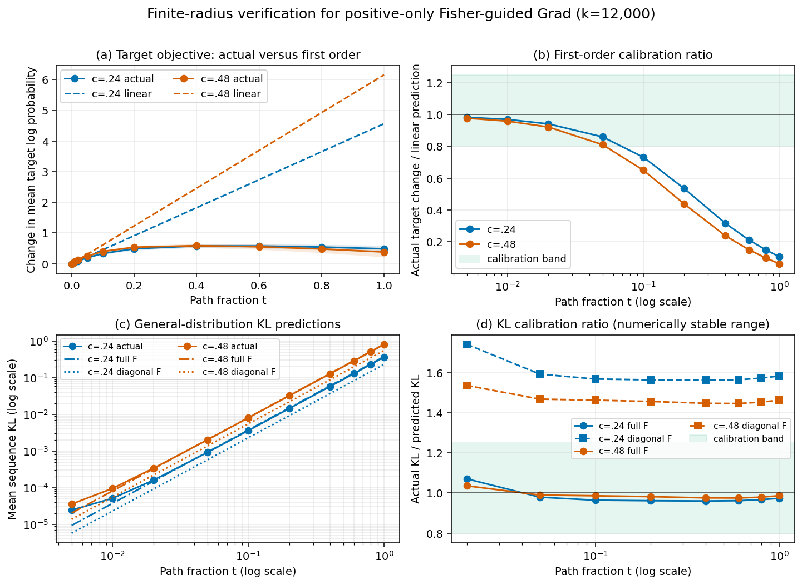

# Finite-radius verification of the Grad target and Fisher approximations

## Conclusion

The minimal verification gives different answers for the two approximations.

1. The first-order target approximation is locally correct but is not
   quantitatively valid at either deployed endpoint. Its point error remains
   below 5% through `t=0.01`; under the pre-registered calibration requirement
   that the paired-bootstrap 95% interval lie inside `[0.8, 1.25]`, the largest
   tested valid radius is `t=0.02`. At `t=1`, the realized target gain is only
   10.7% of the linear prediction for `c=0.24` and 6.2% for `c=0.48`.
2. The full Fisher quadratic form is accurate along both directions throughout
   the numerically stable tested range, `t=0.02` through `1`. At `t=1`, actual
   KL divided by the full-directional Fisher prediction is 0.974 for `c=0.24`
   and 0.987 for `c=0.48`.
3. The diagonal approximation is not calibrated. At `t=1`, it underpredicts
   actual KL by factors of 1.58 and 1.46, respectively. The training and
   validation diagonal curvatures agree closely, so this error is primarily
   caused by omitted cross-neuron terms rather than corpus sampling error.

Thus the experiment supports using a Fisher matrix as the local geometry, but
does not support interpreting the current diagonal Fisher value as the actual
magnitude of $D_{\mathrm{gen}}$. It also shows that the first-order target
gradient supplies a local direction rather than a reliable finite-edit gain
prediction for the selected controllers.

## Protocol

- Model: `Meta-Llama-3-8B-Instruct`, FP32.
- Intervention: positive-only, tail/final-position activation scaling.
- Directions: the existing `k=12,000`, floor-zero, cap-0.75 controllers with
  `c=0.24` and `c=0.48`; damping was one median positive Fisher diagonal when
  the directions were constructed.
- Path: $\alpha(t)=\mathbf 1+t\Delta\alpha$, with
  `t = 0, .005, .01, .02, .05, .1, .2, .4, .6, .8, 1`.
- Target objective: mean teacher-forced log probability of the first completed
  refusal cue on the same 256 raw safe on-policy SNCorpus examples used to
  estimate the ranking gradient. Each example is weighted equally after taking
  the mean over its target cue tokens.
- General cost: 256 disjoint raw WikiText validation contexts, 128 context
  tokens, one 32-token continuation sampled from the unedited model per
  context, and exact full-vocabulary reverse KL on those fixed prefixes. Model
  logits were computed in FP32; vocabulary normalization and KL reduction were
  computed in FP64 to minimize cancellation error without changing the model.
- Directional Fisher: four Rademacher token-score probes per context, giving
  1,024 score vectors over 8,192 generated tokens. The scalar full-Fisher
  curvature was estimated directly as
  $\mathbb E[(s^\top\Delta\alpha)^2]$, without materializing a 12k by 12k
  matrix.
- Uncertainty: 2,000 paired bootstrap samples, resampling target examples or
  WikiText contexts as the independent unit.
- No BeaverTrail, Beaver score, GSM8K, MMLU, or additional frozen benchmark was
  run.

### Runtime benchmark

The Fisher workload already had a persisted H100 benchmark selecting batch 4,
so it was not benchmarked again. Batched target-span scoring was new and was
benchmarked on 32 real first-cue examples before the full run.

| Target batch | Examples/s | Peak H100 memory |
|---:|---:|---:|
| 4 | 74.3 | 33.3 GB |
| **8** | **108.6** | **34.6 GB** |
| 16 | 90.0 | 37.2 GB |
| 32 | 62.6 | 40.6 GB |

Batch 8 is persisted as the target-path default. Gradient checkpointing is not
used because this workload is inference-only and the model fits in memory.

## Target first-order approximation

For each fixed direction $d$, the prediction and measurement are

$$
\Delta L_{\mathrm{linear}}(t)=t\,g^\top d,
\qquad
\Delta L_{\mathrm{actual}}(t)
=L_{\mathrm{tgt}}(\mathbf1+td)-L_{\mathrm{tgt}}(\mathbf1).
$$

The unedited mean target log probability was -0.8995. The complete directions
have predicted linear gains of 4.5645 for `c=0.24` and 6.1578 for `c=0.48`.
Those predictions already exceed the maximum possible mean improvement of
0.8995, so saturation must occur before `t=1`.

| $t$ | `c=.24` actual gain | `c=.24` actual/linear | `c=.48` actual gain | `c=.48` actual/linear |
|---:|---:|---:|---:|---:|
| .005 | .0224 | .983 | .0301 | .977 |
| .01 | .0443 | .970 | .0590 | .959 |
| .02 | .0859 | .941 | .1135 | .922 |
| .05 | .1962 | .860 | .2497 | .811 |
| .10 | .3341 | .732 | .4005 | .650 |
| .20 | .4882 | .535 | .5393 | .438 |
| .40 | **.5802** | .318 | **.5887** | .239 |
| .60 | .5786 | .211 | .5532 | .150 |
| .80 | .5433 | .149 | .4824 | .098 |
| 1.0 | .4871 | **.107** | .3824 | **.062** |

At `t=0.01`, the point errors are 3.0% and 4.1%. At `t=0.02`, they rise to
5.9% and 7.8%, although the ratio confidence intervals remain inside the
pre-registered `[0.8, 1.25]` calibration band: `[0.853, 1.031]` and
`[0.834, 1.011]`. At `t=0.05`, the intervals become `[0.780, 0.943]` and
`[0.735, 0.889]`, so both fail the interval criterion.

The failure is not just a scale mismatch. Both actual target curves peak near
`t=0.4` and then decline. At the deployed endpoints, the initial gradient
predicts `c=0.48` should gain more than `c=0.24`, but the actual ordering is
reversed: 0.382 versus 0.487. Therefore the initial gradient cannot rank these
two finite endpoints by realized target objective.

This does not invalidate the gradient identity at $t=0$. It shows that the
gradient rotates or saturates quickly along these high-dimensional directions.
For this empirical objective, the strict 5%-point-error radius is `t=0.01`, and
the paired-interval calibration radius is `t=0.02`.

## Fisher approximation to general-distribution KL

Three quantities were compared:

$$
D_{\mathrm{actual}}(td),
\qquad
D_{\mathrm{full}}(td)=\tfrac12t^2d^\top Fd,
\qquad
D_{\mathrm{diag}}(td)=\tfrac12t^2\sum_jF_{jj}d_j^2.
$$

### Endpoint calibration

| Direction | Actual KL | Full-Fisher prediction | Actual/full, 95% CI | Training-diagonal prediction | Actual/diagonal |
|---|---:|---:|---:|---:|---:|
| `c=.24` | .3653 | .3751 | .974 `[.857, 1.127]` | .2307 | **1.583** |
| `c=.48` | .8067 | .8176 | .987 `[.869, 1.127]` | .5513 | **1.463** |

From `t=0.02` through `1`, actual/full stays between 0.961 and 1.071 for
`c=0.24`, and between 0.975 and 1.036 for `c=0.48`. Every paired 95% interval
contains 1. There is no evidence of a material finite-radius breakdown of the
full Fisher quadratic along either tested direction, even at the deployed
endpoint.

The `t=.005` and `.01` actual KL values are below the reliable resolution of
the FP32 model forward pass. Recomputing vocabulary normalization and the KL
reduction in FP64 left the anomaly unchanged, ruling out FP32 KL summation as
the cause. At `t=.005`, both directions contain an almost identical additive
excess KL of about $1.5\times10^{-5}$ over their different Fisher predictions,
which is consistent with a forward-computation precision floor rather than a
direction-dependent curvature failure. These points are retained in the
artifacts and overview plot but excluded from the Fisher trust-region
conclusion.

### Diagonal versus cross-neuron curvature

| Direction | Training diagonal curvature | Validation diagonal curvature | Full directional curvature | Validation diagonal/full |
|---|---:|---:|---:|---:|
| `c=.24` | .4614 | .4642 | .7503 | **61.9%** |
| `c=.48` | 1.1027 | 1.1375 | 1.6352 | **69.6%** |

For `c=0.24`, training and held-out diagonal curvature differ by only 0.6%; for
`c=0.48`, they differ by 3.2%. In contrast, the held-out diagonal captures only
61.9% and 69.6% of full directional curvature. The missing non-diagonal term is
positive and large along both positive-only edit directions.

Consequently, estimating more contexts would not repair the main diagonal
error. A calibrated KL trust region needs either full directional curvature for
each candidate direction, a structured/block Fisher approximation, or an
empirical multiplicative correction whose transfer is separately validated.
Diagonal Fisher may still be useful as a coordinate-wise allocation score, but
its quadratic value should not be reported as the estimated $D_{\mathrm{gen}}$
without this qualification.

## Limitations and next step

This is deliberately the minimal test and supports conclusions only along the
two selected directions.

- The target evaluation reuses the 256 examples used to estimate $g$. It
  isolates finite-radius Taylor error, but does not test whether the target
  gradient generalizes. The next target experiment should repeat it on a new,
  disjoint raw SNCorpus safe on-policy first-cue set and compute
  $g_{\mathrm{val}}$ separately.
- Two directions are insufficient to test whether $g^\top d$ ranks a broad
  candidate set correctly. The present endpoint reversal is already a concrete
  failure, but a sweep is needed for a rank-correlation claim.
- Full directional Fisher is estimated with four probes and one sampled
  continuation per context. Its paired confidence intervals quantify context
  variation and probe noise together, but an independent Fisher seed would
  provide a stronger estimator-replication check.
- This experiment tests the mathematical surrogate values. It does not rerun
  frozen HarmBench, IFEval, MATH, or BBH and therefore does not change the
  previously reported behavioral endpoint recommendation.

## Artifacts

- Summary: `results/grad_approx_verify_k12000_c024_c048/summary.json`
- Per-example/per-context tensors:
  `results/grad_approx_verify_k12000_c024_c048/raw_metrics.pt`
- Sampled WikiText continuations:
  `results/grad_approx_verify_k12000_c024_c048/sampled_continuations.jsonl`
- Target benchmark:
  `results/grad_approx_verify_k12000_c024_c048/target_benchmark/benchmark.json`
- Plot source: `scripts/plot_grad_approx_verification.py`
- Figure: `figures/grad_approx_verification_k12000_c024_c048.png` and `.svg`
