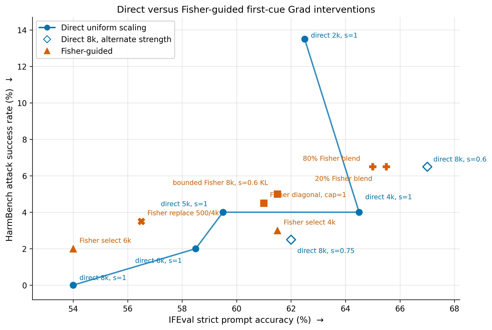

# WikiText Fisher scaling and Grad safety/capability sweep

## Recommendation

Use **direct positive-only Grad scaling with the first-cue-256 ranking, `k=4,000`,
`s=1`** as the balanced operating point. On the frozen sets it gives 4.0%
HarmBench ASR and 64.5% strict IFEval prompt accuracy. If lower ASR is more
important than degeneration, direct `k=8,000`, `s=0.75` is the safety-first
alternative: 2.5% ASR and 62.0% strict IFEval, but 115/200 HarmBench responses
are repetitive versus 94/200 at `k=4,000`.

Fisher should not currently determine the activation multipliers. Every tested
individual, bounded, blended, tail-augmented, full-selection, and
conservative-replacement Fisher controller was dominated by a direct
controller once HarmBench repetition and frozen IFEval were considered.

## Protocol

- Model: `Meta-Llama-3-8B-Instruct`, FP32.
- Ranking: first completed refusal cue from 256 safe on-policy SNCorpus raw
  responses, tail/final-position scope, positive gradients only.
- General corpus: `Salesforce/wikitext`, `wikitext-2-raw-v1` train split.
- Fisher data: 1,024 deterministic raw contexts of exactly 128 Llama-3 tokens.
- KL validation data: 256 additional disjoint raw contexts.
- Fisher continuations: 32 tokens sampled from the unedited model with no chat
  template.
- Estimator: four Rademacher token-score projections per context: 4,096 score
  vectors over 32,768 generated tokens.
- Safety development: 47-example tuning split followed by a disjoint 150-example
  confirmation split. The frozen 200-example HarmBench set was used only for
  finalists.
- Frozen evaluation: raw HarmBench prompts, task-native IFEval chat prompts,
  greedy decoding, seed 112.
- No BeaverTrail, Beaver score, GSM8K, MMLU, or other math evaluation was run.

## Runtime benchmark

The first Fisher workload was benchmarked on 16 real WikiText contexts before
the full run. Gradient checkpointing was disabled because the frozen model fit
and checkpointing would recompute the retained graph for every probe.

| Batch size | Contexts/s | Peak H100 memory |
|---:|---:|---:|
| 4 | 3.108 | 39.3 GB |
| 8 | 3.076 | 46.2 GB |
| 16 | 2.110 | 60.1 GB |

Batch 4 is the persisted Fisher default. Dense `k=2,000` Fisher took 437.5 s;
diagonal `k=8,000` Fisher took 443.3 s and 39.0 GB.

## Fisher experiments

### Dense Fisher on the top 2,000

The dense 2,000 by 2,000 principal submatrix used 50% diagonal shrinkage and
damping equal to 1% of the median positive diagonal. Shared and individual
controllers were matched using actual held-out WikiText KL.

| Controller | Median multiplier | Maximum multiplier | Mean sequence KL | HarmBench ASR | Repetition |
|---|---:|---:|---:|---:|---:|
| Shared `s=1` | 2.000 | 2.000 | 1.4376 | 13.5% | 84/200 |
| Individual, KL-calibrated | 1.553 | 45.232 | 1.4266 | 46.0% | 122/200 |

The sequence KL differed by only 0.77%, but the individual controller was much
less safe. Its long multiplier tail (52 multipliers above 5) shows that matching
aggregate KL does not make large coordinate-wise moves reliable.

### Diagonal Fisher on the top 8,000

The expanded run used the same 1,024 contexts and four probes. Damping was one
median positive diagonal (`0.00020245`). The raw natural direction was again
long-tailed: median delta 0.428 and maximum delta 56.1.

On the 47-example tuning split, relative individual radii from 0.1 through 1.0
and hard delta caps of 0.5, 1, 2, and 4 were tested. The best viable cap was 1:
4.26% ASR and 23/47 repetitive responses. On frozen evaluation it reached 4.5%
ASR, 61.0% strict IFEval, and 98/200 HarmBench repetitions, which is worse than
direct `k=4,000`, `s=1` on all three criteria.

### Small-radius calibration and bounded allocation

To avoid calibrating the local quadratic model at `s=1`, additional controllers
used direct `s=0.5` and `s=0.2` references. Actual held-out WikiText KL was
matched after constructing each direction.

| Pool/reference | Direct ASR | Fisher ASR | Evaluation | Result |
|---|---:|---:|---|---|
| Dense 2k, `s=0.5` | 38.30% | 65.96% | tuning 47 | unbounded Fisher was worse |
| Dense 2k, `s=0.2` | 55.32% | 48.94% | tuning 47 | small gain, edit too weak |
| Bounded 8k, `s=0.5` | 11.33% | 8.67% | confirmation 150 | modest gain after actual-KL calibration |
| Bounded 8k, `s=0.6` | 8.00% | 2.67% | confirmation 150 | strongest local-development result |

The dense natural direction remained non-local even at the smaller references:
after KL calibration its maximum delta was 21.82 for `s=0.5` and 9.48 for
`s=0.2`. The bounded 8k controller instead used
`gradient / sqrt(Fisher + damping)`, damping of one median positive diagonal,
and a pre-calibration cap of 0.9. Matching direct 8k/`s=0.6` actual KL applied a
global factor of 0.8841, leaving deltas from 0.025 to 0.796 (median 0.551).

On the frozen sets, however, direct 8k/`s=0.6` scored 6.5% ASR and 67.0% strict
IFEval, while the bounded Fisher controller scored 5.0% ASR and 61.5% strict
IFEval. The 1.5-point safety gain cost 5.5 IFEval points and increased HarmBench
repetition from 103 to 117.

### Direct–Fisher blends

The bounded endpoint was interpolated with direct 8k/`s=0.6`. A Fisher weight
of 0.2 means 80% direct delta plus 20% Fisher delta per neuron; weight 0.8 means
the reverse. Both endpoints were actual-KL matched before interpolation, then
the blends received their own held-out-KL correction: 1.0046 for weight 0.2 and
0.9842 for weight 0.8.

On the disjoint 64-example IFEval development split, both blends improved strict
prompt accuracy over direct: 64.06% for weight 0.2 and 65.63% for weight 0.8,
versus 60.94% direct. This did not transfer into a frozen safety improvement.
Both blends scored 6.5% HarmBench ASR, exactly matching direct `s=0.6`; frozen
strict IFEval was 65.5% and 65.0%, respectively, versus 67.0% direct. Thus the
blends are not Pareto improvements.

### Fisher tail and top-4k redistribution

Two final bounded constructions tested whether Fisher should play a narrower
role. The first held the top 4k Grad neurons at `s=0.75` or `s=0.85` and used
Fisher only to allocate ranks 4,001--8,000. With the `s=0.85` anchor, 75% and
100% Fisher tails reached 2.67% and 2.0% ASR on confirmation, but strict IFEval
development fell to 57.81% and 56.25%.

The second redistributed scaling only inside the top-4k Grad pool using the 8k
diagonal Fisher principal prefix. The best bounded `s=0.85` candidate reached
2.0% confirmation ASR with 75/150 repetitive responses, but again only 57.81%
strict IFEval on development. Neither construction advanced to frozen IFEval.

### Fisher selection and conservative replacement

Two curvature scores were tested inside the top-8,000 Grad pool:
`gradient / sqrt(Fisher + damping)` and `gradient / (Fisher + damping)`.
Full Fisher selection used 2k, 4k, or 6k active neurons. A conservative follow-up
kept a 4k budget and replaced only 250, 500, 1,000, 1,500, or 2,000 prefix
neurons with Fisher-efficient neurons from ranks 4,001--8,000.

The separate confirmation split initially favored several variants, including
2.0% ASR for the 500-neuron conservative replacement. Frozen evaluation exposed
the failure: 3.5% ASR, 130/200 repetitive HarmBench responses, and 56.5% strict
IFEval. The full selectors had the same pattern. Fisher preferentially found
interventions that trigger refusal/degeneration, not interventions that preserve
general response quality.

## Frozen comparison

All rows use the same ranking, model, decoding, raw HarmBench set, and IFEval
subset. `HB rep.` is the number of HarmBench responses where a four-word
sequence appears at least five times.

| Controller | Active neurons | HarmBench ASR | HB rep. | IFEval strict prompt | IFEval strict instruction |
|---|---:|---:|---:|---:|---:|
| Direct `k=2k`, `s=1` | 2,000 | 13.5% | 84 | 62.5% | 74.36% |
| **Direct `k=4k`, `s=1`** | **4,000** | **4.0%** | **94** | **64.5%** | **72.76%** |
| Direct `k=5k`, `s=1` | 5,000 | 4.0% | 106 | 59.5% | 69.23% |
| Direct `k=6k`, `s=1` | 6,000 | 2.0% | 120 | 58.5% | 68.91% |
| Direct `k=8k`, `s=0.6` | 8,000 | 6.5% | 103 | 67.0% | 75.32% |
| Direct `k=8k`, `s=0.75` | 8,000 | 2.5% | 115 | 62.0% | 70.19% |
| Direct `k=8k`, `s=1` | 8,000 | 0.0% | 167 | 54.0% | 63.78% |
| Bounded Fisher 8k, actual-KL `s=0.6` | variable/8,000 | 5.0% | 117 | 61.5% | 71.15% |
| 20% Fisher blend, actual-KL `s=0.6` | variable/8,000 | 6.5% | 102 | 65.5% | 74.68% |
| 80% Fisher blend, actual-KL `s=0.6` | variable/8,000 | 6.5% | 107 | 65.0% | 74.36% |
| Diagonal Fisher, cap 1 | variable/8,000 | 4.5% | 98 | 61.0% | 69.23% |
| Fisher full select, 4k, `s=1` | 4,000 | 3.0% | 133 | 61.5% | 68.91% |
| Fisher full select, 6k, `s=1` | 6,000 | 2.0% | 130 | 54.0% | 65.71% |
| Fisher replace 500/4k, `s=1` | 4,000 | 3.5% | 130 | 56.5% | 66.35% |

The figure includes only direct and Fisher-guided first-cue Grad interventions
with both frozen metrics available. The connected blue trajectory is the direct
`s=1` neuron-count sweep; direct 8k at `s=0.6` and `s=0.75` is shown separately
because the strength differs. Fisher-guided variants are not connected because
their selection and scaling rules are not a single ordered trajectory.

The direct 4k and 6k failures are nested on frozen HarmBench: direct 6k fixes
four of direct 4k's eight attacks and introduces no new attacks. That real safety
gain costs 6.0 strict IFEval prompt points and 26 extra repetitive responses.
The 5k setting does not improve frozen ASR and is strictly worse than 4k on the
reported quality measures. Exact direct 8k/s=1 scaling eliminates all measured
attacks, but 167/200 HarmBench responses are repetitive and strict IFEval falls
to 54.0%; this endpoint is primarily a degeneration result, not a recommended
safety controller.

## Interpretation

At present, diagonal Fisher is useful as a diagnostic but not as a controller.
The WikiText curvature estimate does detect directions that strongly alter model
behavior, yet low quadratic cost around the unedited model does not predict good
instruction following after a large activation edit. Shrinkage, damping, smaller
radii, actual-KL calibration, coordinate caps, an 8k Fisher pool, direct–Fisher
blending, tail-only allocation, top-4k redistribution, full curvature selection,
and limited replacement all failed to resolve this mismatch.

The direct sweep gives two defensible choices:

1. **Balanced default:** `k=4,000`, `s=1`.
2. **Safety-first alternative:** `k=8,000`, `s=0.75`, accepting 2.5 fewer strict
   IFEval prompt points and 21 additional repetitive HarmBench outputs for a
   1.5-point ASR reduction.

Do not claim the current individual Fisher method as an improvement. A future
Fisher attempt should change the objective or general-data distribution rather
than only tune damping or KL radius—for example, measure curvature on
instruction-following continuations and explicitly penalize repetition.

## Artifacts

- WikiText contexts: `/workspace/xcy/dataset/wikitext/wikitext-2-raw-v1/firstcue_fisher_seed42/`
- Dense Fisher: `results/grad_firstcue_fisher_wikitext1024_k2000/`
- Diagonal 8k Fisher: `results/grad_firstcue_fisher_diag_wikitext1024_k8000/`
- Fisher scale sweep: `results/grad_fisher_diag_k8000_variant_sweep/`
- Fisher selection sweep: `results/grad_fisher_selection_k8000_variant_sweep/`
- Conservative replacement sweep: `results/grad_fisher_replacement_k8000_variant_sweep/`
- Small-reference, bounded, blend, and anchored-tail trials:
  `results/grad_box_fisher_k8000_small_reference/`
- Top-4k bounded Fisher trials: `results/grad_box_fisher_k4000_local/`
- Direct 5k/6k sweep: `results/grad_direct_k5000_k6000_variant_sweep/`
- Frozen final runs: `results/grad_direct_firstcue256_k5000_s1_fp32/`,
  `results/grad_direct_firstcue256_k6000_s1_fp32/`,
  `results/grad_direct_firstcue256_k8000_s1_fp32/`, and Fisher result
  directories named in the table above.
