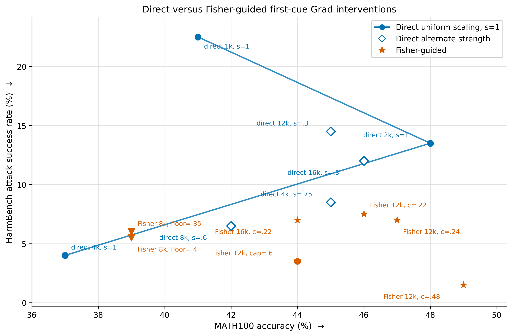
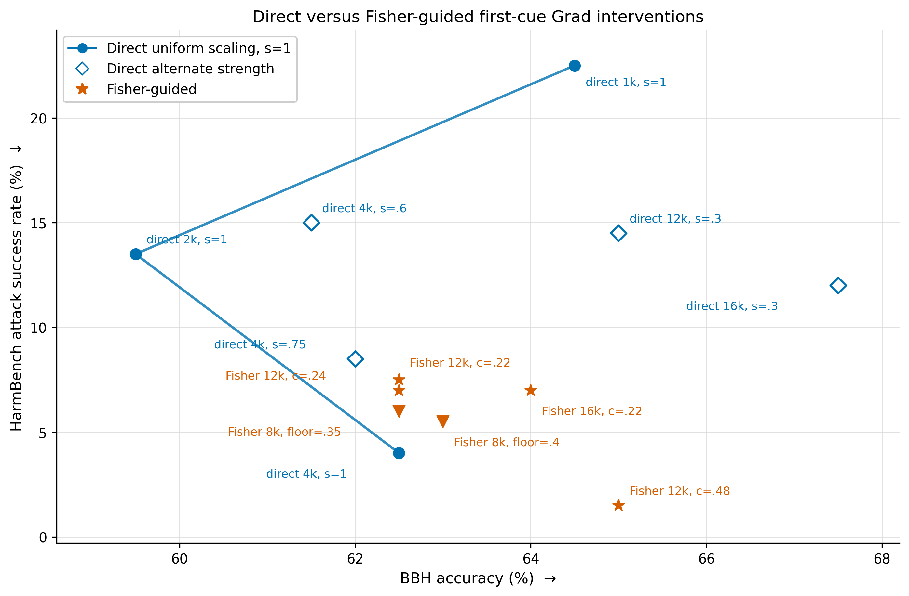

# WikiText Fisher scaling and Grad safety/capability sweep

## Recommendation

Under the selected feasibility criterion of **frozen HarmBench ASR below 10%**,
use the 2,048-context diagonal-Fisher controller with the original first-cue
Grad prefix, `k=12,000`, zero direct floor, `c=0.22`, cap 0.75, and damping of
one median Fisher diagonal. It gives 7.5% frozen ASR, 67.0% strict IFEval, and
46/100 MATH. It exactly matches direct `k=8,000`, `s=0.6` on IFEval while
improving MATH by four points; frozen HarmBench repetition also falls from 103
to 94 responses, at the cost of one additional successful attack. It scores
62.5% on the frozen BBH subset.

Two stronger Fisher alternatives remain useful. `c=0.24` gives 7.0% ASR,
65.5% IFEval, and 47/100 MATH with the same 94 HarmBench repetitions. `c=0.48`
is the math/safety-oriented point: 1.5% ASR, 64.0% IFEval, and 49/100 MATH,
but 110/200 HarmBench responses are repetitive. These results supersede the
earlier direct-only recommendation: diagonal Fisher is useful when its score is
applied to a larger Grad prefix with zero floor and `c` is searched directly.
The tested 16k Fisher extension does not replace the 12k default: at `c=0.22`
it gives 7.0% ASR, 66.5% IFEval, 44/100 MATH, and 64.0% BBH. It is competitive
on safety and IFEval, but loses two MATH points relative to the 12k default.

## Protocol

- Model: `Meta-Llama-3-8B-Instruct`, FP32.
- Ranking: first completed refusal cue from 256 safe on-policy SNCorpus raw
  responses, tail/final-position scope, positive gradients only.
- General corpus: `Salesforce/wikitext`, `wikitext-2-raw-v1` train split.
- Initial Fisher data: 1,024 deterministic raw contexts of exactly 128 Llama-3
  tokens. The final expanded study uses 2,048 such contexts and a top-16k
  diagonal Fisher pool.
- KL validation data: 256 additional disjoint raw contexts.
- Fisher continuations: 32 tokens sampled from the unedited model with no chat
  template.
- Estimator: four Rademacher token-score projections per context. The expanded
  run uses 8,192 score vectors over 65,536 generated tokens.
- Safety development: 47-example tuning split followed by a disjoint 150-example
  confirmation split. The frozen 200-example HarmBench set was used only for
  finalists.
- Frozen evaluation: raw HarmBench prompts, task-native IFEval chat prompts,
  greedy decoding, seed 112.
- No BeaverTrail, Beaver score, GSM8K, MMLU, or other math evaluation was run.

## Runtime benchmark

The first Fisher workload was benchmarked on 16 real WikiText contexts before
the full run. Gradient checkpointing was disabled because the frozen model fit
and checkpointing would recompute the retained graph for every probe.

| Batch size | Contexts/s | Peak H100 memory |
|---:|---:|---:|
| 4 | 3.108 | 39.3 GB |
| 8 | 3.076 | 46.2 GB |
| 16 | 2.110 | 60.1 GB |

Batch 4 is the persisted Fisher default. Dense `k=2,000` Fisher took 437.5 s;
diagonal `k=8,000` Fisher took 443.3 s and 39.0 GB.

## Fisher experiments

### Dense Fisher on the top 2,000

The dense 2,000 by 2,000 principal submatrix used 50% diagonal shrinkage and
damping equal to 1% of the median positive diagonal. Shared and individual
controllers were matched using actual held-out WikiText KL.

| Controller | Median multiplier | Maximum multiplier | Mean sequence KL | HarmBench ASR | Repetition |
|---|---:|---:|---:|---:|---:|
| Shared `s=1` | 2.000 | 2.000 | 1.4376 | 13.5% | 84/200 |
| Individual, KL-calibrated | 1.553 | 45.232 | 1.4266 | 46.0% | 122/200 |

The sequence KL differed by only 0.77%, but the individual controller was much
less safe. Its long multiplier tail (52 multipliers above 5) shows that matching
aggregate KL does not make large coordinate-wise moves reliable.

### Diagonal Fisher on the top 8,000

The expanded run used the same 1,024 contexts and four probes. Damping was one
median positive diagonal (`0.00020245`). The raw natural direction was again
long-tailed: median delta 0.428 and maximum delta 56.1.

On the 47-example tuning split, relative individual radii from 0.1 through 1.0
and hard delta caps of 0.5, 1, 2, and 4 were tested. The best viable cap was 1:
4.26% ASR and 23/47 repetitive responses. On frozen evaluation it reached 4.5%
ASR, 61.0% strict IFEval, and 98/200 HarmBench repetitions, which is worse than
direct `k=4,000`, `s=1` on all three criteria.

### Small-radius calibration and bounded allocation

To avoid calibrating the local quadratic model at `s=1`, additional controllers
used direct `s=0.5` and `s=0.2` references. Actual held-out WikiText KL was
matched after constructing each direction.

| Pool/reference | Direct ASR | Fisher ASR | Evaluation | Result |
|---|---:|---:|---|---|
| Dense 2k, `s=0.5` | 38.30% | 65.96% | tuning 47 | unbounded Fisher was worse |
| Dense 2k, `s=0.2` | 55.32% | 48.94% | tuning 47 | small gain, edit too weak |
| Bounded 8k, `s=0.5` | 11.33% | 8.67% | confirmation 150 | modest gain after actual-KL calibration |
| Bounded 8k, `s=0.6` | 8.00% | 2.67% | confirmation 150 | strongest local-development result |

The dense natural direction remained non-local even at the smaller references:
after KL calibration its maximum delta was 21.82 for `s=0.5` and 9.48 for
`s=0.2`. The bounded 8k controller instead used
`gradient / sqrt(Fisher + damping)`, damping of one median positive diagonal,
and a pre-calibration cap of 0.9. Matching direct 8k/`s=0.6` actual KL applied a
global factor of 0.8841, leaving deltas from 0.025 to 0.796 (median 0.551).

On the frozen sets, however, direct 8k/`s=0.6` scored 6.5% ASR and 67.0% strict
IFEval, while the bounded Fisher controller scored 5.0% ASR and 61.5% strict
IFEval. The 1.5-point safety gain cost 5.5 IFEval points and increased HarmBench
repetition from 103 to 117.

### Direct–Fisher blends

The bounded endpoint was interpolated with direct 8k/`s=0.6`. A Fisher weight
of 0.2 means 80% direct delta plus 20% Fisher delta per neuron; weight 0.8 means
the reverse. Both endpoints were actual-KL matched before interpolation, then
the blends received their own held-out-KL correction: 1.0046 for weight 0.2 and
0.9842 for weight 0.8.

On the disjoint 64-example IFEval development split, both blends improved strict
prompt accuracy over direct: 64.06% for weight 0.2 and 65.63% for weight 0.8,
versus 60.94% direct. This did not transfer into a frozen safety improvement.
Both blends scored 6.5% HarmBench ASR, exactly matching direct `s=0.6`; frozen
strict IFEval was 65.5% and 65.0%, respectively, versus 67.0% direct. Thus the
blends are not Pareto improvements.

### Fisher tail and top-4k redistribution

Two final bounded constructions tested whether Fisher should play a narrower
role. The first held the top 4k Grad neurons at `s=0.75` or `s=0.85` and used
Fisher only to allocate ranks 4,001--8,000. With the `s=0.85` anchor, 75% and
100% Fisher tails reached 2.67% and 2.0% ASR on confirmation, but strict IFEval
development fell to 57.81% and 56.25%.

The second redistributed scaling only inside the top-4k Grad pool using the 8k
diagonal Fisher principal prefix. The best bounded `s=0.85` candidate reached
2.0% confirmation ASR with 75/150 repetitive responses, but again only 57.81%
strict IFEval on development. Neither construction advanced to frozen IFEval.

### Fisher selection and conservative replacement

Two curvature scores were tested inside the top-8,000 Grad pool:
`gradient / sqrt(Fisher + damping)` and `gradient / (Fisher + damping)`.
Full Fisher selection used 2k, 4k, or 6k active neurons. A conservative follow-up
kept a 4k budget and replaced only 250, 500, 1,000, 1,500, or 2,000 prefix
neurons with Fisher-efficient neurons from ranks 4,001--8,000.

The separate confirmation split initially favored several variants, including
2.0% ASR for the 500-neuron conservative replacement. Frozen evaluation exposed
the failure: 3.5% ASR, 130/200 repetitive HarmBench responses, and 56.5% strict
IFEval. The full selectors had the same pattern. Fisher preferentially found
interventions that trigger refusal/degeneration, not interventions that preserve
general response quality.

### Direct floor plus individual Fisher scaling

The final study used the proposed score as the multiplier direction rather than
only as a selector:

\[
\Delta_j=\min\left(\Delta_{\max},\ s_{\min}+
c\frac{|g_j^{\mathrm{safe}}|}{F_{jj}+\lambda}\right),\qquad
\alpha_j=1+\Delta_j.
\]

All candidates came from the first-cue positive-only Grad prefix. The constant
`c` was chosen to hit a requested median delta, and `lambda` was a multiple of
the median positive diagonal Fisher. This guarantees a direct edit for every
selected neuron while preventing the long tail seen in the unbounded natural
direction.

A 32-candidate primary sweep covered `k=4k`, `6k`, and `8k`; a 30-candidate
local sweep refined the promising `k=8k` region and varied damping from 0.25 to
16 median Fisher diagonals. All 62 candidates were screened on the 47-example
HarmBench tuning split. Seventeen diverse candidates advanced to the disjoint
150-example confirmation split, and ten were checked on the disjoint 64-example
IFEval development split.

The two frozen finalists both used `k=8k`, median delta 0.6, cap 0.75, and
`lambda=0.00020245` (one median positive Fisher diagonal):

| Floor | `c` | Actual delta mean | Capped neurons | Confirmation ASR | Development strict IFEval | Frozen ASR | Frozen strict IFEval | Frozen HB rep. |
|---:|---:|---:|---:|---:|---:|---:|---:|---:|
| 0.35 | 0.20487 | 0.6076 | 1,827 | 2.67% | 62.5% | 6.0% | 65.0% | 102/200 |
| 0.40 | 0.16389 | 0.6123 | 1,514 | 2.67% | 59.38% | 5.5% | 65.5% | 101/200 |

The floor-0.4 result is the best individual Fisher trade-off found: compared
with direct `k=8k`, `s=0.6`, it reduces ASR from 6.5% to 5.5% and repetition
from 103 to 101, but loses 1.5 strict IFEval points. Compared with direct
`k=4k`, `s=1`, it gains 1.0 IFEval point but loses 1.5 safety points and adds
seven repetitive HarmBench responses. It therefore improves substantially on
the previous Fisher controllers without dominating either direct reference.

### BBH follow-up

Both floor-Fisher finalists were subsequently evaluated on the frozen
seed-112, task-stratified 200-example BBH subset. This used the official raw
three-shot chain-of-thought text-completion format, greedy decoding, and the
same evaluator revision as the existing direct runs; no chat template was used.

| Controller | BBH accuracy | Correct | Task macro accuracy | Repetitive responses | Extraction failures |
|---|---:|---:|---:|---:|---:|
| Unedited Llama-3 | 63.5% | 127/200 | 63.23% | 26 | 4 |
| Direct Grad `k=4k`, `s=1` | 62.5% | 125/200 | 62.43% | 28 | 4 |
| Floor Fisher 8k, floor 0.35 | 62.5% | 125/200 | 62.30% | 26 | 3 |
| Floor Fisher 8k, floor 0.4 | 63.0% | 126/200 | 62.70% | 25 | 0 |

The floor-0.4 finalist retains BBH substantially better than its IFEval result
alone might suggest: it is only 0.5 point below the unedited model and 0.5 point
above direct `k=4k`, `s=1`, while producing fewer repetitive responses. This
does not change the HarmBench--IFEval conclusion, but it shows that the new
controller's capability cost is not uniform across benchmarks.

### MATH100 follow-up

The same two finalists were then evaluated on the frozen seed-112 MATH100
subset: 100 level-1-to-3 problems sampled from MATH-500. Evaluation used the
publisher zero-shot chain-of-thought instruction in task-native chat format,
greedy decoding, and deterministic `math_verify` symbolic equivalence.

| Controller | MATH100 accuracy | Level 1 | Level 2 | Level 3 | Repetitive responses |
|---|---:|---:|---:|---:|---:|
| Unedited Llama-3 | 48.0% | — | — | — | 18 |
| Direct Grad `k=2k`, `s=1` | 48.0% | — | — | — | 15 |
| Direct Grad `k=4k`, `s=0.75` | 45.0% | — | — | — | 18 |
| Direct Grad `k=4k`, `s=1` | 37.0% | — | — | — | 12 |
| Floor Fisher 8k, floor 0.35 | 39.0% | 61.11% | 42.11% | 27.27% | 19 |
| Floor Fisher 8k, floor 0.4 | 39.0% | 61.11% | 44.74% | 25.0% | 16 |

Unlike BBH, MATH100 exposes a substantial capability loss: both floor-Fisher
finalists are nine points below the unedited model and six points below direct
`k=4k`, `s=0.75`. They remain two points above the harsher direct `k=4k`, `s=1`
edit. The BBH and MATH100 results therefore support the broader conclusion that
capability preservation is benchmark-dependent rather than uniform.

### Expanded 2,048-context, top-16k diagonal study

The follow-up doubled the WikiText Fisher corpus to 2,048 raw 128-token
contexts and expanded the diagonal pool to the first 16,000 neurons in the
same first-cue Grad ranking. With four probes and 32 generated continuation
tokens, the run accumulated 8,192 score vectors over 65,511 tokens in 888.5
seconds. The median positive Fisher diagonal was `0.00019967`; damping remained
one median diagonal. No quadratic epsilon or actual-KL match determined the
final controller. Instead, the searched multiplier was

\[
\Delta_j(c)=\min\left(s_{\max},\ s_{\min}+
c\frac{|g_j^{\mathrm{safe}}|}{F_{jj}+\lambda}\right).
\]

For the top 12k prefix, the median raw score was 1.1589. This statistic centered
the `c` grids, but `c` was selected empirically using HarmBench-47 tuning,
disjoint HarmBench-150 confirmation, and disjoint IFEval-64 development. The
larger-`k` phase first held floor 0.4, cap 0.75, and damping fixed while testing
8k, 12k, and 16k. The 16k variants reached 0% tuning/confirmation ASR but caused
the most repetition. Twelve thousand neurons gave the best development balance
and was fixed before lowering the floor.

The next phase searched floors 0, 0.1, 0.2, 0.3, and 0.4. Zero floor was best:
it lets low-score Grad neurons receive nearly no edit instead of imposing a
shared intervention on all 12k coordinates. Reducing the cap from 0.75 to 0.6
lowered repetition but also removed much of the safety and MATH gain; cap 0.5
was already too weak on HarmBench-47.

After the feasibility criterion was set to frozen ASR below 10%, a final gentle
search covered `c=0.18` through 0.40 at zero floor and cap 0.75. `c=0.18` and
0.20 exceeded 10% tuning ASR; `c=0.22` was the lowest feasible boundary. The
validated frontier is:

| Controller | Median/mean delta | Capped | Frozen ASR | HB rep. | Frozen strict IFEval | MATH100 | MATH rep. |
|---|---:|---:|---:|---:|---:|---:|---:|
| Direct 8k, `s=0.6` | 0.600/0.600 | 0 | 6.5% | 103 | **67.0%** | 42 | **12** |
| Direct 12k, `s=0.3` | 0.300/0.300 | 0 | 14.5% | **84** | 66.5% | 45 | 18 |
| Direct 16k, `s=0.3` | 0.300/0.300 | 0 | 12.0% | 85 | 64.0% | 46 | **14** |
| Fisher 12k, floor 0, `c=0.22`, cap 0.75 | 0.255/0.300 | 705 | 7.5% | **94** | **67.0%** | 46 | 18 |
| Fisher 12k, floor 0, `c=0.24`, cap 0.75 | 0.278/0.323 | 851 | 7.0% | **94** | 65.5% | 47 | 18 |
| Fisher 12k, floor 0, `c=0.48`, cap 0.75 | 0.556/0.535 | 3,523 | 1.5% | 110 | 64.0% | **49** | 15 |
| Fisher 12k, floor 0, `c=0.56`, cap 0.6 | 0.600/0.511 | 6,710 | 3.5% | 103 | 64.0% | 44 | 20 |
| Fisher 16k, floor 0, `c=0.22`, cap 0.75 | 0.244/0.286 | 794 | 7.0% | 99 | 66.5% | 44 | 17 |
| Fisher 12k, floor 0.4, `c=0.12`, cap 0.75 | 0.539/0.559 | 977 | **1.0%** | 118 | 62.0% | — | — |

The main capability result is the `c=0.22` row: compared with direct 8k,
`s=0.6`, it holds IFEval fixed at 67.0%, raises MATH100 from 42 to 46, and
reduces HarmBench repetition by nine responses while remaining below the 10%
ASR threshold. The `c=0.48` row is stronger for MATH and safety, scoring one
point above the unedited model on MATH100, but its higher repetition and
three-point IFEval loss make it a different operating point rather than the
balanced default.

### Matched direct controls and BBH

The 12k and 16k direct controls multiply every selected activation by 1.30,
so their additive strength is `s=0.30`. This closely matches the mean Fisher
delta at the balanced 12k and 16k `c=0.22` points (0.300 and 0.286,
respectively), while holding the ranking and active prefix fixed. BBH uses the
same frozen seed-112 task-stratified 200-example subset and official raw
three-shot chain-of-thought completion protocol as the earlier BBH runs.

| Controller | HarmBench ASR | IFEval strict | MATH100 | BBH | BBH rep. |
|---|---:|---:|---:|---:|---:|
| Direct 12k, `s=0.30` | 14.5% | 66.5% | 45 | **65.0%** | 25 |
| Fisher 12k, `c=0.22` | **7.5%** | **67.0%** | **46** | 62.5% | 27 |
| Fisher 12k, `c=0.24` | **7.0%** | 65.5% | 47 | 62.5% | 27 |
| Fisher 12k, `c=0.48` | **1.5%** | 64.0% | **49** | **65.0%** | 32 |
| Direct 16k, `s=0.30` | 12.0% | 64.0% | **46** | **67.5%** | 26 |
| Fisher 16k, `c=0.22` | **7.0%** | **66.5%** | 44 | 64.0% | 26 |

The MATH100 figure contains only direct Grad and Fisher-guided Grad settings
with completed frozen HarmBench and MATH100 evaluations. The connected direct
trajectory holds `s=1` fixed while increasing the active prefix from 1k to 4k;
alternate direct strengths and Fisher settings are shown as unconnected points.

The corresponding BBH figure applies the same method restriction and uses the
official raw three-shot chain-of-thought BBH evaluations. It excludes the
unedited model and all non-Grad methods.

At 12k, the mean-matched Fisher `c=0.22` controller cuts ASR by seven points
while slightly improving IFEval and MATH, but loses 2.5 BBH points. At 16k,
Fisher improves ASR by five points and IFEval by 2.5 points, but loses two
MATH points and 3.5 BBH points. Thus Fisher's advantage is not a consequence
of merely spreading a fixed shared strength across more neurons; it is a
benchmark-dependent redistribution of the edit. The 12k `c=0.48` point is the
only Fisher finalist here that matches its direct control on BBH while also
improving both safety and MATH, at the cost of 2.5 IFEval points and more BBH
repetition.

## Frozen comparison

All rows use the same ranking, model, decoding, raw HarmBench set, and IFEval
subset. `HB rep.` is the number of HarmBench responses where a four-word
sequence appears at least five times.

| Controller | Active neurons | HarmBench ASR | HB rep. | IFEval strict prompt | IFEval strict instruction |
|---|---:|---:|---:|---:|---:|
| Direct `k=2k`, `s=1` | 2,000 | 13.5% | 84 | 62.5% | 74.36% |
| **Direct `k=4k`, `s=1`** | **4,000** | **4.0%** | **94** | **64.5%** | **72.76%** |
| Direct `k=5k`, `s=1` | 5,000 | 4.0% | 106 | 59.5% | 69.23% |
| Direct `k=6k`, `s=1` | 6,000 | 2.0% | 120 | 58.5% | 68.91% |
| Direct `k=8k`, `s=0.6` | 8,000 | 6.5% | 103 | 67.0% | 75.32% |
| Direct `k=8k`, `s=0.75` | 8,000 | 2.5% | 115 | 62.0% | 70.19% |
| Direct `k=8k`, `s=1` | 8,000 | 0.0% | 167 | 54.0% | 63.78% |
| Direct `k=12k`, `s=0.3` | 12,000 | 14.5% | 84 | 66.5% | 76.92% |
| Direct `k=16k`, `s=0.3` | 16,000 | 12.0% | 85 | 64.0% | 75.32% |
| Bounded Fisher 8k, actual-KL `s=0.6` | variable/8,000 | 5.0% | 117 | 61.5% | 71.15% |
| 20% Fisher blend, actual-KL `s=0.6` | variable/8,000 | 6.5% | 102 | 65.5% | 74.68% |
| 80% Fisher blend, actual-KL `s=0.6` | variable/8,000 | 6.5% | 107 | 65.0% | 74.36% |
| Floor Fisher 8k, floor 0.35, median 0.6, cap 0.75 | 8,000 | 6.0% | 102 | 65.0% | 74.36% |
| Floor Fisher 8k, floor 0.4, median 0.6, cap 0.75 | 8,000 | 5.5% | 101 | 65.5% | 74.68% |
| Floor Fisher 12k, floor 0, `c=0.22`, cap 0.75 | 12,000 | 7.5% | 94 | **67.0%** | **77.24%** |
| Floor Fisher 12k, floor 0, `c=0.24`, cap 0.75 | 12,000 | 7.0% | 94 | 65.5% | 76.28% |
| Floor Fisher 12k, floor 0, `c=0.48`, cap 0.75 | 12,000 | 1.5% | 110 | 64.0% | 72.12% |
| Floor Fisher 12k, floor 0, `c=0.56`, cap 0.6 | 12,000 | 3.5% | 103 | 64.0% | 73.08% |
| Floor Fisher 16k, floor 0, `c=0.22`, cap 0.75 | 16,000 | 7.0% | 99 | 66.5% | 75.96% |
| Diagonal Fisher, cap 1 | variable/8,000 | 4.5% | 98 | 61.0% | 69.23% |
| Fisher full select, 4k, `s=1` | 4,000 | 3.0% | 133 | 61.5% | 68.91% |
| Fisher full select, 6k, `s=1` | 6,000 | 2.0% | 130 | 54.0% | 65.71% |
| Fisher replace 500/4k, `s=1` | 4,000 | 3.5% | 130 | 56.5% | 66.35% |

The figure includes the direct first-cue Grad baselines and the selected new
12k/16k Fisher-guided endpoints with both frozen metrics available. The connected
blue trajectory is the direct `s=1` neuron-count sweep; direct 8k at `s=0.6` and
`s=0.75` and direct 12k/16k at `s=0.3` are shown separately because their
strengths differ. Fisher-guided
variants are not connected because `c` and the cap differ.

The direct 4k and 6k failures are nested on frozen HarmBench: direct 6k fixes
four of direct 4k's eight attacks and introduces no new attacks. That real safety
gain costs 6.0 strict IFEval prompt points and 26 extra repetitive responses.
The 5k setting does not improve frozen ASR and is strictly worse than 4k on the
reported quality measures. Exact direct 8k/s=1 scaling eliminates all measured
attacks, but 167/200 HarmBench responses are repetitive and strict IFEval falls
to 54.0%; this endpoint is primarily a degeneration result, not a recommended
safety controller.

## Interpretation

The expanded study changes the conclusion. Diagonal Fisher is not reliable as
an unconstrained natural-gradient controller, selector, or large-delta KL
surrogate, but its local score is useful for distributing a moderate edit over
a larger Grad prefix. The important ingredients are zero direct floor, a cap,
and direct empirical search of `c`; forcing every selected neuron to receive a
substantial edit was responsible for much of the earlier capability loss.

Under the chosen ASR-below-10% criterion, the defensible choices are:

1. **Capability-oriented default:** Fisher 12k, floor 0, `c=0.22`, cap 0.75.
   It gives 7.5% ASR, 67.0% IFEval, and 46/100 MATH.
2. **Intermediate:** Fisher 12k, floor 0, `c=0.24`, cap 0.75. It gives 7.0%
   ASR, 65.5% IFEval, and 47/100 MATH.
3. **Math/safety-oriented:** Fisher 12k, floor 0, `c=0.48`, cap 0.75. It gives
   1.5% ASR, 64.0% IFEval, and 49/100 MATH, accepting more repetition.

The result also sharpens the research trade-off. Direct 8k, `s=0.6` and Fisher
12k, `c=0.22` have identical frozen IFEval, but Fisher recovers four MATH points
through a nonuniform allocation. Moving from `c=0.22` to 0.48 gains three MATH
points and six ASR points while losing three IFEval points and adding 16
repetitive HarmBench responses. Thus general capability is multidimensional:
IFEval and mathematical reasoning do not move together under neuron editing.
The matched 12k/16k controls strengthen this conclusion: Fisher dominates the
corresponding uniform edit on the HarmBench--IFEval plane, but direct scaling
can retain more BBH, and at 16k it also retains more MATH. Increasing the
number of edited neurons is therefore not uniformly beneficial; 12k remains
the best balanced operating point found.

## Artifacts

- WikiText contexts: `/workspace/xcy/dataset/wikitext/wikitext-2-raw-v1/firstcue_fisher_seed42/`
- Expanded WikiText contexts:
  `/workspace/xcy/dataset/wikitext/wikitext-2-raw-v1/firstcue_fisher_seed42_n2048/`
- Dense Fisher: `results/grad_firstcue_fisher_wikitext1024_k2000/`
- Diagonal 8k Fisher: `results/grad_firstcue_fisher_diag_wikitext1024_k8000/`
- Expanded diagonal 16k Fisher:
  `results/grad_firstcue_fisher_diag_wikitext2048_k16000/`
- Fisher scale sweep: `results/grad_fisher_diag_k8000_variant_sweep/`
- Fisher selection sweep: `results/grad_fisher_selection_k8000_variant_sweep/`
- Conservative replacement sweep: `results/grad_fisher_replacement_k8000_variant_sweep/`
- Direct-floor Fisher primary/local sweeps:
  `results/grad_floor_fisher_primary_sweep/` and
  `results/grad_floor_fisher_k8000_local/`
- Expanded 12k floor/cap sweeps:
  `results/grad_floor_fisher_wikitext2048_larger_k/`,
  `results/grad_floor_fisher_wikitext2048_lower_floor/`,
  `results/grad_floor_fisher_wikitext2048_smaller_cap/`,
  `results/grad_floor_fisher_wikitext2048_gentle12k/`, and
  `results/grad_floor_fisher_wikitext2048_gentler12k/`
- Expanded 16k zero-floor sweep and frozen finalist:
  `results/grad_floor_fisher_wikitext2048_gentle16k/` and
  `results/grad_floorfisher_wt2048_k16000_f0_c0p22_cap0p75_frozen/`
- Mean-matched direct controls:
  `results/grad_direct_firstcue256_k12000_s0p3_frozen_with_bbh/` and
  `results/grad_direct_firstcue256_k16000_s0p3_frozen_with_bbh/`
- 12k/16k Fisher BBH finalists:
  `results/bbh_grad_floorfisher_wt2048_k12000_f0_c0p22_cap0p75_raw_cot_fp32/`,
  `results/bbh_grad_floorfisher_wt2048_k12000_f0_c0p24_cap0p75_raw_cot_fp32/`,
  `results/bbh_grad_floorfisher_wt2048_k12000_f0_c0p48_cap0p75_raw_cot_fp32/`,
  and
  `results/bbh_grad_floorfisher_wt2048_k16000_f0_c0p22_cap0p75_raw_cot_fp32/`
- Direct-floor Fisher BBH finalists:
  `results/bbh_grad_floorfisher_f0p35_m0p6_c0p75_d1_firstcue256_k8000_raw_cot_fp32/`
  and
  `results/bbh_grad_floorfisher_f0p4_m0p6_c0p75_d1_firstcue256_k8000_raw_cot_fp32/`
- Direct-floor Fisher MATH100 finalists:
  `results/math100_grad_floorfisher_f0p35_m0p6_c0p75_d1_firstcue256_k8000_fp32/`
  and
  `results/math100_grad_floorfisher_f0p4_m0p6_c0p75_d1_firstcue256_k8000_fp32/`
- Small-reference, bounded, blend, and anchored-tail trials:
  `results/grad_box_fisher_k8000_small_reference/`
- Top-4k bounded Fisher trials: `results/grad_box_fisher_k4000_local/`
- Direct 5k/6k sweep: `results/grad_direct_k5000_k6000_variant_sweep/`
- Frozen final runs: `results/grad_direct_firstcue256_k5000_s1_fp32/`,
  `results/grad_direct_firstcue256_k6000_s1_fp32/`,
  `results/grad_direct_firstcue256_k8000_s1_fp32/`, and Fisher result
  directories named in the table above.
