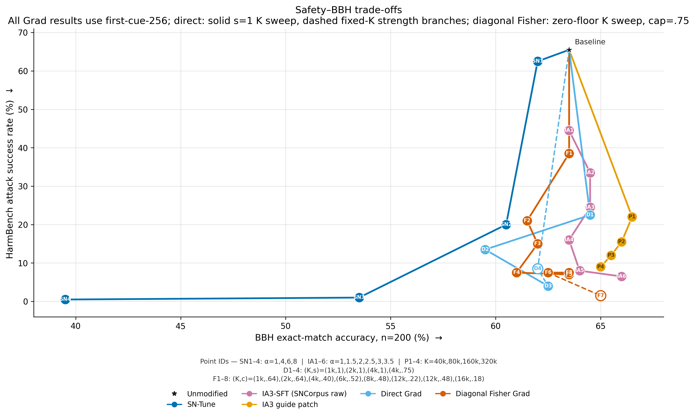
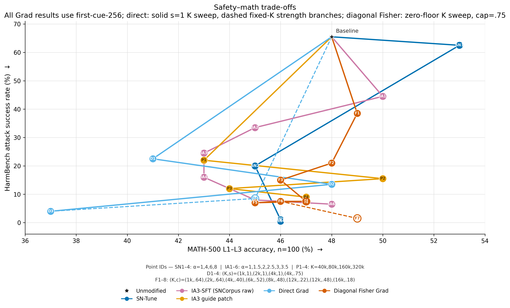

# IA3 guide-patch 160k/320k BBH and MATH100

## Result

The requested SNCorpus-raw SFT IA3 guide-patch runs are complete. Expanding
the copied activation set from 160k to 320k leaves BBH essentially unchanged
(65.5% versus 65.0%) while improving MATH100 from 44/100 to 47/100. Neither
larger patch dominates the earlier 80k result, which scored 66.0% BBH and
50/100 MATH100.

| Patch K | BBH | BBH repetitive | BBH at token limit | MATH100 | MATH repetitive | MATH at token limit |
|---:|---:|---:|---:|---:|---:|---:|
| 40k | 66.5% | 100/200 | 80/200 | 43/100 | 18/100 | 4/100 |
| 80k | 66.0% | 106/200 | 85/200 | **50/100** | 18/100 | 2/100 |
| 160k | **65.5%** | 103/200 | 84/200 | 44/100 | 19/100 | 2/100 |
| 320k | 65.0% | 101/200 | 72/200 | **47/100** | 18/100 | 2/100 |

The bold entries within the requested 160k/320k pair identify the better
result for each capability benchmark. BBH differs by one answer, whereas
MATH100 differs by three answers.

## Figures

The common point key labels the IA3 guide-patch series as P1–P4 for
`K=40k, 80k, 160k, 320k`; therefore the new points are P3 and P4. Point IDs are
drawn directly over their markers.

## Protocol

- Base: `Meta-Llama-3-8B-Instruct`.
- Guide: the IA3 adapter trained on the first 256 SNCorpus raw refusal pairs.
- IA3 displacement multiplier: alpha 3, using
  `1 + alpha * (trained_gate - 1)`.
- Patch: copy the guide's ranked post-MLP activations into the base model.
- Ranking: held-out SNCorpus raw-completion Instruct-vs-IA3-SFT change scores.
- Precision: BF16 for the two-model guide patch.
- BBH: fixed seed-112 task-stratified 200-example subset, official raw
  three-shot CoT completion, greedy decoding, maximum 1,024 new tokens.
- MATH100: the fixed level-1-to-3 seed-112 100-example subset, publisher
  zero-shot CoT prompt in task-native chat, `math_verify` scoring, greedy
  decoding, maximum 1,024 new tokens.
- No Beaver cost/score, BeaverTrail, GSM8K, or MMLU evaluation was run.

The existing real-prompt benchmarks were reused. MATH uses batch 32. BBH batch
16 completed the 160k run, but the 320k activation bridge exceeded H100 memory
on a long batch after 32 examples. The 320k runner therefore resumes and
persists batch 8; all first 32 responses were retained under the same semantic
fingerprint.

## Validation

Both BBH outputs contain exactly 200 unique response IDs, and both MATH outputs
contain exactly 100 responses. Run configs record the requested K, alpha 3,
SNCorpus-raw IA3 guide, BF16 patch precision, and disabled cost scoring.
